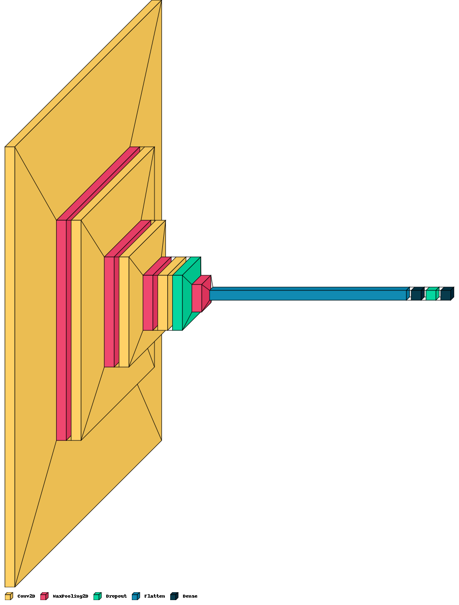

# COVID-19 Lung CT Scans Classification with Convolutional Neural Networks (CNN)

## Introduction
This project aims to classify COVID-19 and non-COVID-19 lung CT scans using Convolutional Neural Networks (CNN). The dataset used in this project is sourced from [Kaggle](https://www.kaggle.com/datasets/luisblanche/covidct/data).

## Dataset
The dataset contains lung CT scans categorized into COVID-19 positive and negative cases. It consists of a total of 746 images, with 349 COVID-19 positive cases and 397 COVID-19 negative cases.

## Approach
- **Data Preprocessing**: Preprocess the images, including resizing and  normalization.
- **Model Architecture**: Implement a CNN model for image classification.
- **Training**: Train the CNN model on the preprocessed data.
- **Evaluation**: Evaluate the model's performance using metrics such as accuracy, precision, recall, and F1-score.
- **Results Analysis**: Analyze the results and discuss the model's performance.

## CNN Architecture
The CNN model architecture used in this project is as follows:
- Input Layer: 3x224x224 (RGB image)
- Convolutional Layers with ReLU activation
- MaxPooling Layers
- Flatten Layer
- Fully Connected Layers with ReLU activation
- Output Layer with Sigmoid activation

## Results
The model achieved the following performance metrics on the test set:
- Accuracy: 72%
- Precision: 
  - COVID-19 Negative (0): 84%
  - COVID-19 Positive (1): 66%
- Recall: 
  - COVID-19 Negative (0): 55%
  - COVID-19 Positive (1): 89%
- F1-score:
  - COVID-19 Negative (0): 67%
  - COVID-19 Positive (1): 76%

## Conclusion
The CNN model showed promising results in classifying COVID-19 and non-COVID-19 lung CT scans. Further improvements can be made by experimenting with different architectures, hyperparameters, and preprocessing techniques.
